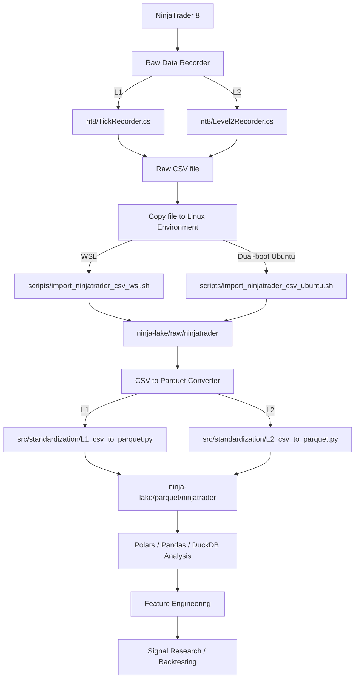

<h1 align="center">NinjaTrader Tick Data Recording Flow Diagram</h1>

## Notes

- NinjaTrader records raw L1/L2 market data as CSV files.
- Import scripts move the raw CSV files into the project data lake on Linux environment.
- Standardization scripts convert raw CSV into Parquet.
- Analysis scripts use the Parquet files for feature engineering, signal research, and backtesting.

## Future Improvements

- Add automated scheduled imports
- Add validation checks for missing timestamps / session gaps
- Add optional cloud backup for raw and Parquet data
- Add metadata tracking for instrument, session, and feed type