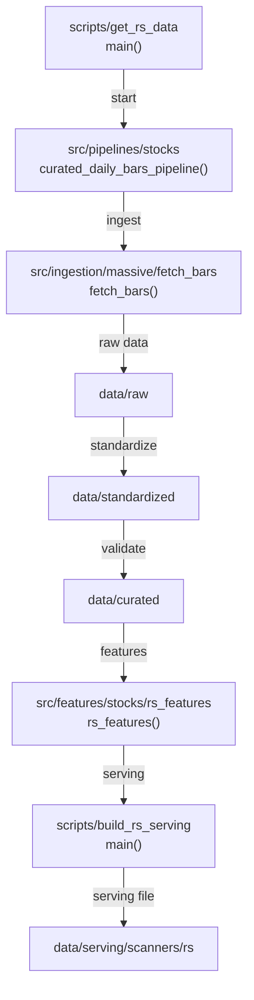

<h1 align="center">RS Data Pipeline Flow</h1>

```mermaid


flowchart TD
    START["scripts/get_rs_data<br/>main()"]
    START --start-->

    CURATED_PIPELINE["src/pipelines/stocks<br/>curated_daily_bars_pipeline()"]
    CURATED_PIPELINE --ingest-->

    FETCH["src/ingestion/massive/fetch_bars<br/>fetch_bars()"]
    FETCH --raw data--> 

    RAW["data/raw"]
    RAW --standardize--> 

    STANDARDIZE["data/standardized"]
    STANDARDIZE --validate--> 

    VALIDATE["data/curated"]
    VALIDATE --features--> 

    FEATURES["src/features/stocks/rs_features<br/>rs_features()"]
    FEATURES --serving--> 

    SERVING["scripts/build_rs_serving<br/>main()"]
    SERVING --serving file--> 
    
    SERVING_FILE["data/serving/scanners/rs"]
```