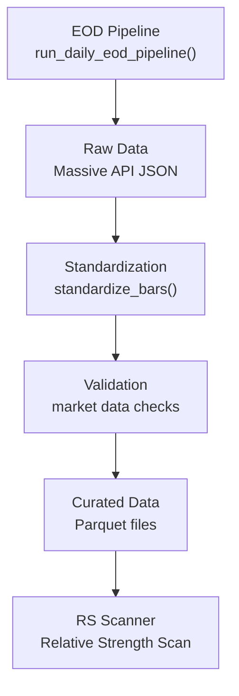

<h1 align="center">RS Scanner Data Flow</h1>

```mermaid
flowchart TD
    EOD["EOD Pipeline<br/>run_daily_eod_pipeline()"]

    EOD --> Raw["Raw Data<br/>Massive API JSON"]
    Raw --> Standardization["Standardization<br/>standardize_bars()"]
    Standardization --> Validation["Validation<br/>market data checks"]
    Validation --> Curated["Curated Data<br/>Parquet files"]
    Curated --> RS["RS Scanner<br/>Relative Strength Scan"]
```
